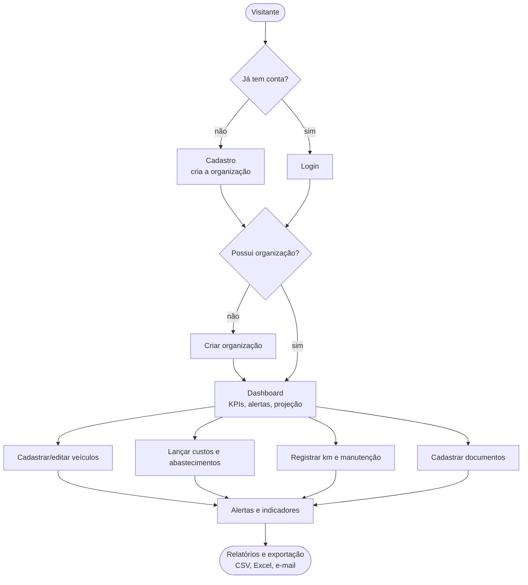
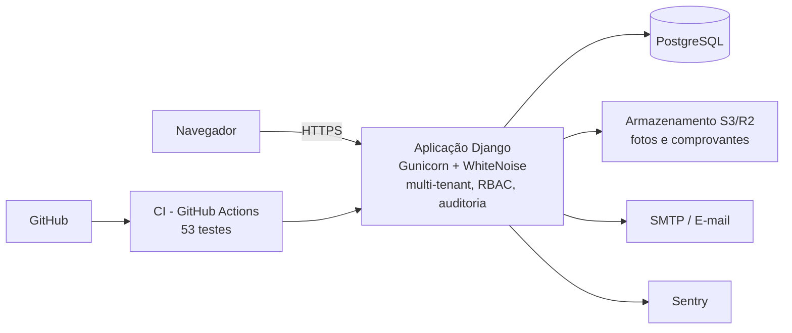
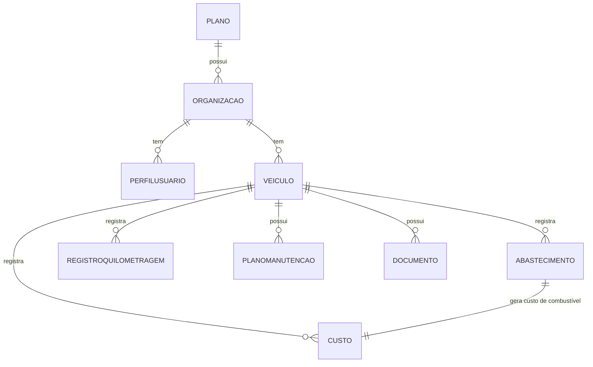

# Gestão de Frotas — Documentação Técnica

Sistema web **multi-tenant** para gestão de frota de veículos e controle de
custos, manutenção e documentação.

- **Stack:** Python 3.12 · Django 5.2 · PostgreSQL
- **Arquitetura:** SaaS multi-tenant (isolamento por organização)
- **Cobertura:** 53 testes automatizados

> Versão visual (com fluxograma e diagramas): publicada como Artifact no Claude Code.

---

## 1. Visão geral

O sistema permite a uma organização cadastrar seus veículos e acompanhar, de
forma centralizada, os **custos**, **abastecimentos**, **quilometragem**,
**manutenções preventivas** e **documentos** de cada veículo. A partir desses
dados, calcula indicadores gerenciais (consumo médio, custo por km, custo por
categoria), projeta o fechamento do mês e emite alertas de manutenção e de
vencimento de documentos.

É **multi-tenant**: cada organização vê apenas os próprios dados, com controle
de acesso por papéis — adequado tanto para uso interno quanto para venda (SaaS).

## 2. Atores e perfis (RBAC por organização)

| Papel | Descrição | Permissões |
|---|---|---|
| Visitante | Não autenticado | Cadastro, login, recuperação de senha, páginas legais |
| Administrador | Dono da conta | Tudo: usuários, papéis, plano e dados da frota |
| Gestor | Operação da frota | Cria/edita/visualiza dados; recebe alertas |
| Operador | Registro do dia a dia | Lança custos, abastecimentos e manutenção |
| Consulta | Somente leitura | Visualiza dados, dashboard e relatórios |

## 3. Fluxograma de uso

## 4. Arquitetura de implantação

A aplicação é **stateless**: o estado vive no PostgreSQL e os arquivos no
armazenamento externo, permitindo escalar em múltiplos contêineres.

## 5. Modelo de dados

A **Organização** é a raiz do isolamento: como todo registro depende de um
Veículo, e o Veículo pertence a uma Organização, cada consulta é filtrada pela
conta do usuário.

## 6. Requisitos funcionais

Prioridade: **Alta** essencial · **Média** importante · **Baixa** desejável.

### Autenticação e conta
| ID | Requisito | Prioridade |
|---|---|---|
| RF-01 | Cadastro autosserviço (usuário + organização + perfil admin), com aceite LGPD | Alta |
| RF-02 | Login e logout | Alta |
| RF-03 | Recuperação de senha por e-mail (link com expiração) | Alta |
| RF-04 | Onboarding: usuário sem organização é direcionado a criar uma | Alta |
| RF-05 | Adicionar usuários por convite (e-mail para definir senha) | Média |
| RF-06 | Definir/alterar papel de cada usuário | Média |
| RF-07 | Remover usuários (exceto a si mesmo) | Baixa |
| RF-08 | Página da conta (organização, plano, assinatura) | Média |

### Multi-tenancy, planos e cobrança
| ID | Requisito | Prioridade |
|---|---|---|
| RF-09 | Isolar dados por organização | Alta |
| RF-10 | Controle de acesso por papéis (bloqueio de escrita para Consulta) | Alta |
| RF-11 | Associar organização a um plano com limite de veículos | Média |
| RF-12 | Impedir cadastro de veículo ao atingir o limite do plano | Média |
| RF-13 | Indicar status da assinatura (em dia/pendente) | Baixa |

### Veículos
| ID | Requisito | Prioridade |
|---|---|---|
| RF-14 | CRUD de veículos | Alta |
| RF-15 | Cadastro completo: marca, modelo, ano, cor, placa, Renavam, chassi, combustível, data/valor de aquisição, foto, status, observações, meta de custo | Alta |
| RF-16 | Busca por marca/modelo/placa e filtro por status | Média |
| RF-17 | Paginação da listagem | Baixa |

### Custos, abastecimentos e quilometragem
| ID | Requisito | Prioridade |
|---|---|---|
| RF-18 | CRUD de custos (tipo, descrição, valor, data, km, fornecedor, forma de pagamento) | Alta |
| RF-19 | Anexar comprovante (foto/PDF) ao custo | Média |
| RF-20 | Combustível como fonte única (abastecimento gera o custo, sem contagem dupla) | Alta |
| RF-21 | Registrar abastecimentos (data, km, litros, valor, posto, tipo) | Alta |
| RF-22 | Calcular consumo médio (km/l), custo/km e preço/litro | Alta |
| RF-23 | Histórico de quilometragem e km atual derivado | Média |

### Manutenção e documentos
| ID | Requisito | Prioridade |
|---|---|---|
| RF-24 | Planos de manutenção por km e/ou data, com status (em dia/próxima/atrasada) | Alta |
| RF-25 | Documentos com vencimento e status (vencido/vence em breve/em dia) | Alta |

### Dashboard e relatórios
| ID | Requisito | Prioridade |
|---|---|---|
| RF-26 | KPIs (veículos, ativos, em manutenção, custo do mês) | Alta |
| RF-27 | Projeção de fechamento do mês | Média |
| RF-28 | Gráfico de custos dos últimos 6 meses | Média |
| RF-29 | Custos do mês por categoria | Média |
| RF-30 | Ranking de veículos por custo | Baixa |
| RF-31 | Alertas de manutenção da frota | Alta |
| RF-32 | Painel dos próximos 90 dias (documentos + manutenções por data) | Alta |
| RF-33 | Relatórios por categoria e por veículo com filtro de período | Média |
| RF-34 | Exportar custos em CSV e Excel | Média |

### Alertas, auditoria e conformidade
| ID | Requisito | Prioridade |
|---|---|---|
| RF-35 | Alertar quando o custo do mês estourar a meta do veículo | Média |
| RF-36 | Enviar alertas por e-mail (manutenção, documentos, orçamento), agendável | Média |
| RF-37 | Auditoria das alterações (quem, o quê, quando) | Média |
| RF-38 | Termos de Uso e Política de Privacidade (LGPD) com consentimento | Alta |

## 7. Requisitos não funcionais

| ID | Categoria | Requisito |
|---|---|---|
| RNF-01 | Segurança | Autenticação obrigatória; CSRF; hash de senha (PBKDF2); CSRF trusted origins em HTTPS; isolamento multi-tenant em todas as queries |
| RNF-02 | Autorização | Papéis; Consulta não altera dados; só admin gerencia usuários/plano |
| RNF-03 | Privacidade | LGPD: consentimento, minimização de dados, páginas legais |
| RNF-04 | Desempenho | Índices (Custo.data/veículo, Documento.vencimento, Veículo.org/status); agregações contra N+1; paginação |
| RNF-05 | Escalabilidade | Multi-tenant; contêineres stateless; mídia em S3/R2 |
| RNF-06 | Disponibilidade | Docker + Gunicorn; migrações no boot; deploy contínuo (Railway) |
| RNF-07 | Observabilidade | Sentry (opcional) e logging |
| RNF-08 | Backup | Rotina pg_dump agendável |
| RNF-09 | Manutenibilidade | Apps Django separados; 53 testes; CI (GitHub Actions) |
| RNF-10 | Portabilidade | Config por variáveis de ambiente (12-factor); `DATABASE_URL` |
| RNF-11 | Usabilidade | Tema escuro responsivo; feedback; confirmação em exclusões |
| RNF-12 | Internacionalização | pt-BR; fuso America/Sao_Paulo |
| RNF-13 | Integridade | Placa única por organização; combustível fonte única; cascatas coerentes |
| RNF-14 | Compatibilidade | Navegadores modernos; PostgreSQL 14+; Python 3.12 |

## 8. Regras de negócio

- **Fonte única de combustível:** o abastecimento cria/mantém o custo de combustível; excluí-lo remove o custo.
- **Placa única por organização:** não se repete dentro da mesma conta.
- **Km atual derivado:** maior leitura entre abastecimentos e registros de km.
- **Status de manutenção:** combina km e data, escolhendo o mais crítico.
- **Status de documento:** vencido / vence em breve (≤30 dias) / em dia.
- **Alerta de orçamento:** verde ≤80%, amarelo ≤100%, vermelho acima da meta.
- **Limite de plano:** o cadastro respeita o limite de veículos do plano.

## 9. Stack e tecnologias

| Camada | Tecnologia |
|---|---|
| Linguagem / framework | Python 3.12 · Django 5.2 |
| Banco de dados | PostgreSQL (psycopg2 / dj-database-url) |
| Servidor | Gunicorn · WhiteNoise |
| Mídia | FileSystem (dev) · S3/R2 via django-storages (prod) |
| E-mail | SMTP configurável (console em dev) |
| Auditoria | django-auditlog |
| Monitoramento | Sentry (opcional) |
| Relatórios | CSV nativo · Excel (openpyxl) |
| Implantação | Docker · Railway · GitHub Actions |

## 10. Pendências e evolução

- **Gateway de pagamento** (Stripe / Mercado Pago) com webhook de assinatura.
- **Custos recorrentes/parcelados** (IPVA, seguro).
- **Depreciação** a partir do valor de aquisição.
- **Relatório em PDF** e filtros de período no dashboard.
- **2FA** e limite de tentativas de login.
